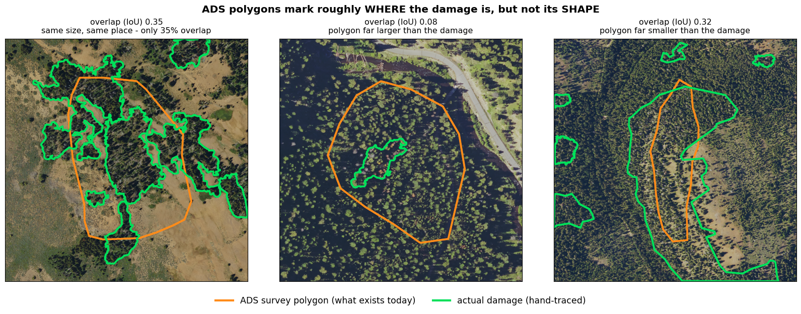
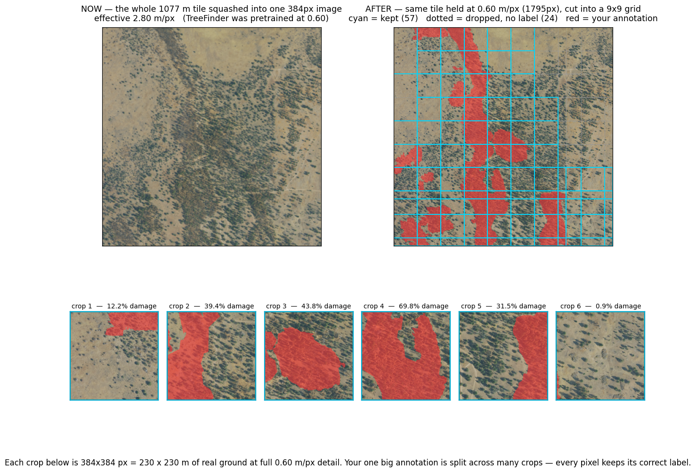

# Recovering Forest Damage Annotations from Aerial Imagery

Turning coarse U.S. Forest Service survey polygons into pixel-accurate forest damage maps.

**Google Summer of Code 2026** · [DeepForest](https://github.com/weecology/DeepForest) / Weecology, University of Florida
Contributor: **Muhammad Saqlain** · Mentors: **Ben Weinstein**, **Josh Veitch-Michaelis**

---

## The problem

Aerial Detection Survey (ADS) polygons are sketched by surveyors from a moving aircraft. They show
roughly *where* forest damage is, but their boundaries do not follow the actual damage.



The project began by assuming the polygons were **shifted** and could be moved back into place.
Testing that was the first result, and it was negative:

> **The corrections are reshapes, not shifts.** No amount of moving, rotating or scaling recovers
> the true boundary, because the polygon's *shape* is wrong, not its position.

So the project changed direction: instead of moving the polygon, **predict the damage region
directly from the imagery**, using the polygon only as a weak hint.

## The result

A U-Net pretrained on [TreeFinder](https://proceedings.neurips.cc/paper_files/paper/2025/file/f22625283cf5812f45933610314259be-Paper-Datasets_and_Benchmarks_Track.pdf),
fine-tuned on 146 hand-annotated 30 cm tiles from Oregon.

| | region IoU | recall |
|---|---|---|
| ADS polygon as-is | 0.115 | — |
| Fine-tuned, tiles resized | 0.116 ± 0.027 | 0.33 |
| **Fine-tuned, fixed 0.60 m/px crops** | **0.251 ± 0.019** | **0.46** |

<!-- IMAGE 2: sheet_best.png — model predictions that match the labels -->

### The main finding: pixel scale was the bottleneck, not data volume

Tiles cover 180 m to 1500 m of ground. Resizing them all to the same 384 px meant the model saw
resolutions from 0.61 to 3.68 m/px, while its pretrained features were learned at a constant
0.60 m/px. A dead tree crown is 16 px wide at 0.60 m/px and 2.5 px at 3.7 m/px — at which point the
texture that separates dead canopy from bare soil is simply gone.

Cutting tiles into fixed-resolution crops instead of resizing them **more than doubled IoU**.



The cleanest evidence needs no statistics:

> **Zero-shot IoU rose from 0.040 to 0.108** — the *same* pretrained weights with *no* training, on
> the *same* ground. Only the pixel scale changed.

### What does not work yet

- **Small damage is missed.** About 25% of damaged crops get no prediction at all. The model has
  learned a large-area texture cue and cannot resolve individual dead trees.
- **False alarms rose to 6.5%** of pixels on tiles verified as healthy.
- **Labels are partial.** Annotators traced damage clusters, not every tree, so IoU is a lower bound.

<!-- IMAGE 3: sheet_worst.png and sheet_paint_everything.png — the two failure modes -->

Full numbers, negative results and caveats: **[RESULTS.md](RESULTS.md)**.

---

## How it is evaluated

```
206 tiles (146 damage + 60 verified healthy)
   |  cut into 384x384 crops at a fixed 0.60 m/px
2,320 crops
   |  grouped by location
5 folds -> train on 4, test on the 5th, five times
```

<!-- IMAGE 4: the cross-validation diagram -->

Three rules keep the number honest:

1. **Folds are split by geography.** Nearby tiles look almost identical, so a random split would let
   the model see its own test data.
2. **Crops from one tile stay together**, so overlapping crops never straddle train and test.
3. **A separate slice picks the settings.** The training epoch and the decision threshold are
   *chosen* from 240 candidates. Choosing them on the test set inflates the score by about 0.056, so
   they are chosen on 15% held out of the *training* data instead.

---

## Repository

| Folder | Contents |
|---|---|
| `data_prep/` | Fetch 30 cm imagery around ADS polygons; **`build_crops_30cm.py`** produces the fixed-resolution crops |
| `annotation/` | Labelme helpers, auto-drafting, mask conversion, review tools |
| `training/` | TreeFinder pretraining and **`finetune_30cm.py`** — cross-validation and evaluation |
| `validation/` | Independent checks against a second expert's corrections |
| `studies/` | Earlier experiments, including the retired alignment approach that produced the reshape finding |

## Running it

```bash
pip install -r requirements.txt
```

Run everything from the repository root:

```bash
python data_prep/build_30cm_seed_tiles.py     # fetch imagery
python annotation/labelme_seed.py             # prepare tracing guides
labelme data/seed30cm/images --output data/seed30cm/labelme --labels damage,prior
python annotation/labelme_to_masks.py         # -> masks
python data_prep/build_crops_30cm.py          # -> fixed 0.60 m/px crops
```

Then run `training/finetune_30cm.py` on Colab with Drive mounted (~70 min on an A100).

Scripts are [jupytext](https://jupytext.readthedocs.io/) percent-format, so each one is both a
script and a notebook. To open in Colab:

```bash
jupytext --to ipynb training/finetune_30cm.py
```

Data, checkpoints and generated figures are not tracked — all are reproducible from the scripts.

## License

MIT — see [LICENSE](LICENSE).

## Acknowledgements

Mentors Ben Weinstein and Josh Veitch-Michaelis (Weecology, University of Florida).
Pretraining uses the TreeFinder dataset (NeurIPS 2025). Imagery from USDA NAIP and Oregon OSIP;
annotations from the USFS Aerial Detection Survey.
