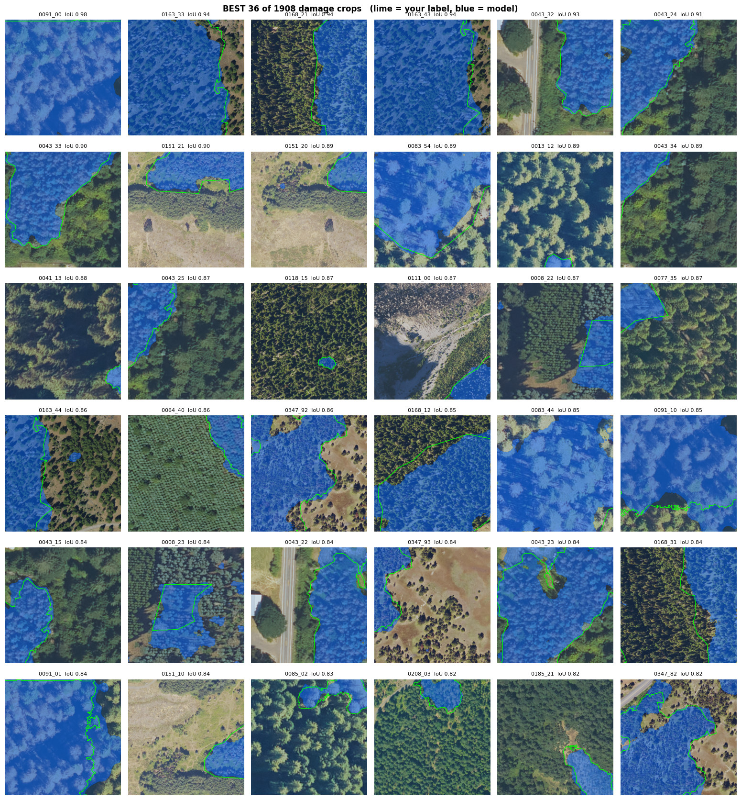
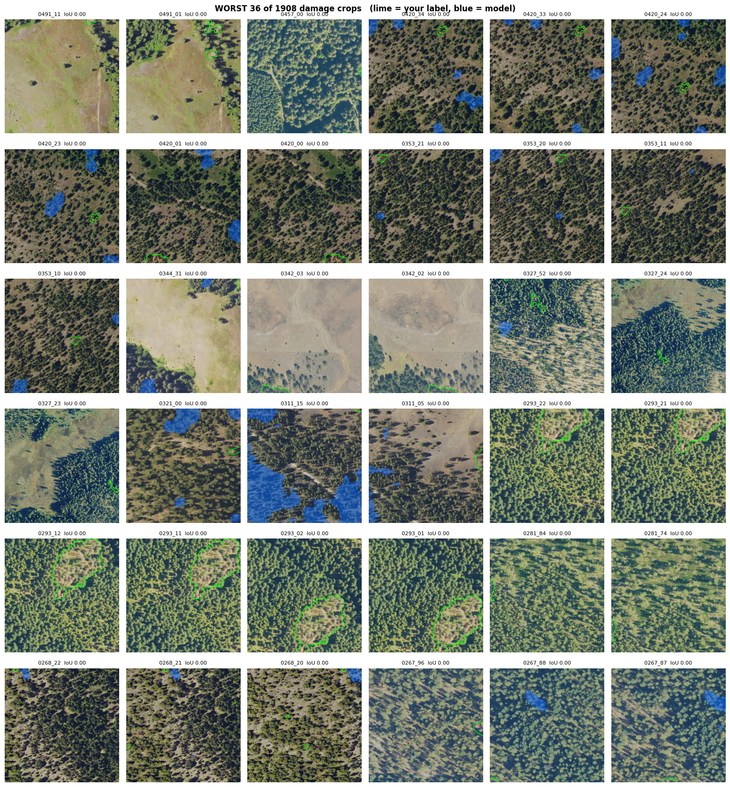
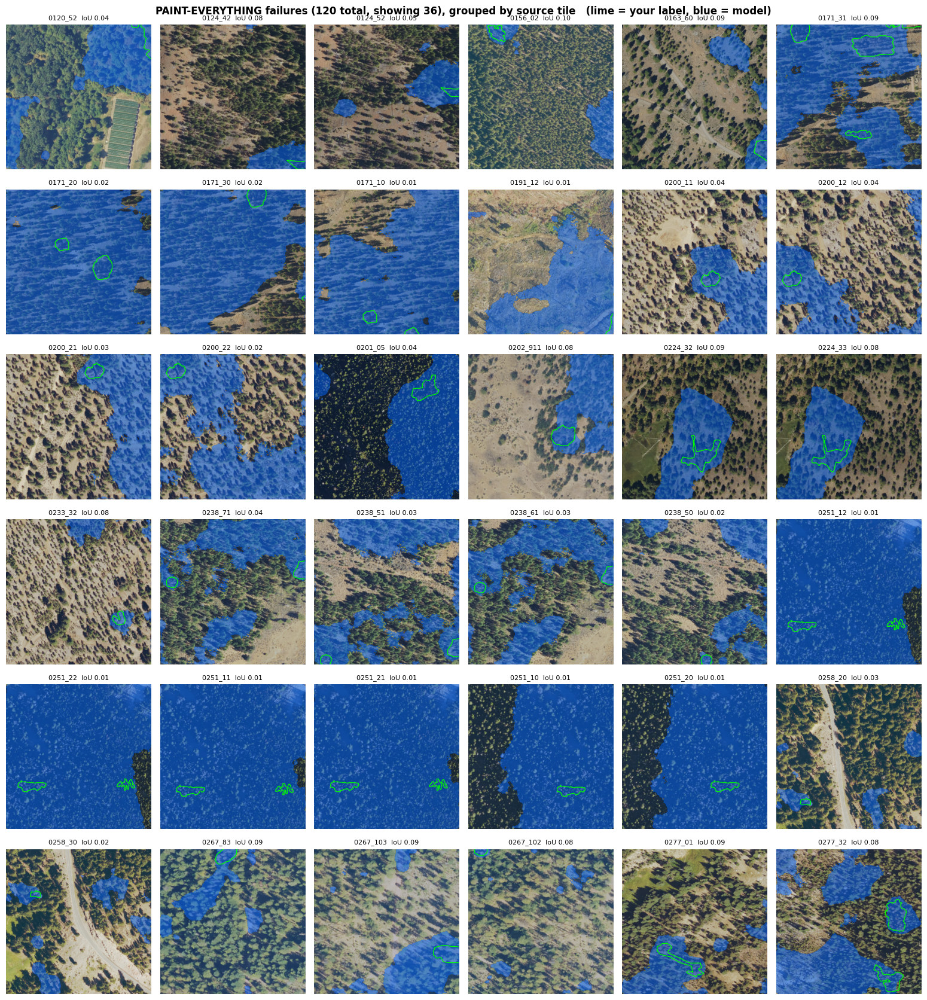
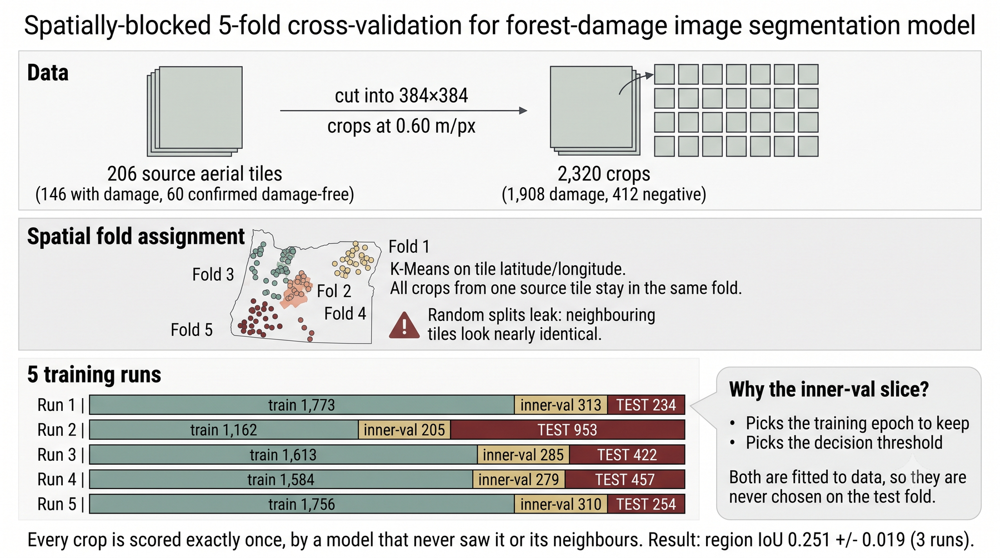

# Recovering Forest Damage Annotations from Aerial Imagery

Turning coarse U.S. Forest Service survey polygons into pixel-accurate forest damage maps.

**Google Summer of Code 2026** · [DeepForest](https://github.com/weecology/DeepForest) / Weecology, University of Florida
Contributor: **Muhammad Saqlain** · Mentors: **Ben Weinstein**, **Josh Veitch-Michaelis**

---

## The problem

Aerial Detection Survey (ADS) polygons are sketched by surveyors from a moving aircraft. They show
roughly *where* forest damage is, but their boundaries do not follow the actual damage.


The project began by assuming the polygons were **shifted** and could be moved back into place.
Testing that was the first result, and it was negative:

> **The corrections are reshapes, not shifts.** No amount of moving, rotating or scaling recovers
> the true boundary, because the polygon's *shape* is wrong, not its position.

So the project changed direction: instead of moving the polygon, **predict the damage region
directly from the imagery**, using the polygon only as a weak hint.

## The result

A U-Net pretrained on [TreeFinder](https://proceedings.neurips.cc/paper_files/paper/2025/file/f22625283cf5812f45933610314259be-Paper-Datasets_and_Benchmarks_Track.pdf),
fine-tuned on 146 hand-annotated 30 cm tiles from Oregon.

Two things were changed, and the table separates them: **training on our labels**, and **feeding the
model imagery at the resolution it was pretrained on**. Neither alone is enough.

| | trained on our labels? | imagery at 0.60 m/px? | region IoU | recall |
|---|:---:|:---:|---|---|
| Use the ADS polygon as the answer | — | — | 0.115 | — |
| TreeFinder model, used as-is | no | no | 0.040 | — |
| TreeFinder model, used as-is | no | **yes** | 0.108 | — |
| Fine-tuned, whole tiles squashed to 384 px | **yes** | no | 0.116 ± 0.027 | 0.33 |
| **Fine-tuned, cut into 0.60 m/px crops** | **yes** | **yes** | **0.251 ± 0.019** | **0.46** |

Fixing the resolution alone gets 0.108. Training on our labels alone gets 0.116. Doing both gets
0.251 — more than the two gains added together.



*Where it works: the 36 best of 1,908 damage crops. Green = hand-drawn label, blue = model.*

### The main finding: pixel scale was the bottleneck, not data volume

The tiles are not all the same size on the ground: the smallest covers 180 m across, the largest
1500 m. But every one of them was squashed to the same 384 × 384 pixel image before training. A
small tile therefore kept fine detail, and a large one was crushed — one pixel ended up meaning
anywhere from 0.61 m to 3.68 m of real ground.

That matters because of what a dead tree looks like. A dead conifer and bare soil are almost the
same colour; the only thing separating them is texture and crown shape. A crown is about 9.5 m
across, which is **16 pixels wide at 0.60 m/px** — clearly a tree. On a squashed large tile it is
**2.5 pixels**. At that size the texture is gone, and the model is being asked to separate two things
that now look identical.

The fix is to stop squashing. Cut every tile into 384 × 384 pieces at a fixed 0.60 m/px instead — the
exact resolution the pretrained model learned on — and take as many pieces as the tile yields. That
change alone **more than doubled IoU**.


The cleanest evidence needs no statistics:

> **Zero-shot IoU rose from 0.040 to 0.108** — the *same* pretrained weights with *no* training, on
> the *same* ground. Only the pixel scale changed.

### What does not work yet

- **Small damage is missed.** About 25% of damaged crops get no prediction at all. The model has
  learned a large-area texture cue and cannot resolve individual dead trees.
- **False alarms rose to 6.5%** of pixels on tiles verified as healthy.
- **Labels are partial.** Annotators traced damage clusters, not every tree, so IoU is a lower bound.

The failures come in exactly two shapes.



*Failure 1 — nothing predicted. The label (green) is small or the damage is sparse, and the model
returns empty. Note how many of these are open ground with a few scattered dead trees.*



*Failure 2 — the whole crop is painted. 90 crops, mostly from a handful of source tiles. The blue
often covers healthy dark canopy, so these are genuine false positives, not missing labels.*

Full numbers, negative results and caveats: **[RESULTS.md](RESULTS.md)**.

---

## How it is evaluated



Three rules keep the number honest:

1. **Folds are split by geography.** Nearby tiles look almost identical, so a random split would let
   the model see its own test data.
2. **Crops from one tile stay together**, so overlapping crops never straddle train and test.
3. **A separate slice picks the settings.** The training epoch and the decision threshold are
   *chosen* from 240 candidates. Choosing them on the test set inflates the score by about 0.056, so
   they are chosen on 15% held out of the *training* data instead.

---

## Repository

| Folder | Contents |
|---|---|
| `data_prep/` | Fetch 30 cm imagery around ADS polygons; **`build_crops_30cm.py`** produces the fixed-resolution crops |
| `annotation/` | Labelme helpers, auto-drafting, mask conversion, review tools |
| `training/` | TreeFinder pretraining and **`finetune_30cm.py`** — cross-validation and evaluation |
| `validation/` | Independent checks against a second expert's corrections |
| `studies/` | Earlier experiments, including the retired alignment approach that produced the reshape finding |

## Running it

```bash
pip install -r requirements.txt
```

Run everything from the repository root:

```bash
python data_prep/build_30cm_seed_tiles.py     # fetch imagery
python annotation/labelme_seed.py             # prepare tracing guides
labelme data/seed30cm/images --output data/seed30cm/labelme --labels damage,prior
python annotation/labelme_to_masks.py         # -> masks
python data_prep/build_crops_30cm.py          # -> fixed 0.60 m/px crops
```

Then run `training/finetune_30cm.py` on Colab with Drive mounted (~70 min on an A100).

Scripts are [jupytext](https://jupytext.readthedocs.io/) percent-format, so each one is both a
script and a notebook. To open in Colab:

```bash
jupytext --to ipynb training/finetune_30cm.py
```

Data, checkpoints and generated figures are not tracked — all are reproducible from the scripts.

## License

MIT — see [LICENSE](LICENSE).

## Acknowledgements

Mentors Ben Weinstein and Josh Veitch-Michaelis (Weecology, University of Florida).
Pretraining uses the TreeFinder dataset (NeurIPS 2025). Imagery from USDA NAIP and Oregon OSIP;
annotations from the USFS Aerial Detection Survey.
