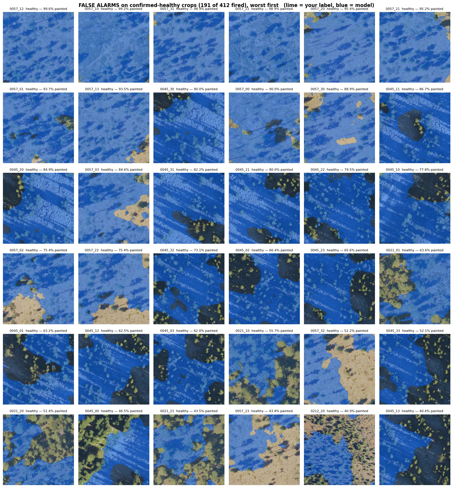

# Recovering Forest Damage Annotations from Aerial Imagery

Turning coarse U.S. Forest Service survey polygons into pixel-accurate forest damage maps.

**Google Summer of Code 2026** · [DeepForest](https://github.com/weecology/DeepForest) / Weecology, University of Florida
Contributor: **Muhammad Saqlain** · Mentors: **Ben Weinstein**, **Josh Veitch-Michaelis**

---

## The problem

Aerial Detection Survey (ADS) polygons are sketched by surveyors from a moving aircraft. They show
roughly *where* forest damage is, but their boundaries do not follow the actual damage.


The project began by assuming the polygons were **shifted** and could be moved back into place.
Testing that was the first result, and it was negative:

> **The corrections are reshapes, not shifts.** No amount of moving, rotating or scaling recovers
> the true boundary, because the polygon's *shape* is wrong, not its position.

So the project changed direction: instead of moving the polygon, **predict the damage region
directly from the imagery**, using the polygon only as a weak hint.

## The result

A U-Net pretrained on [TreeFinder](https://proceedings.neurips.cc/paper_files/paper/2025/file/f22625283cf5812f45933610314259be-Paper-Datasets_and_Benchmarks_Track.pdf),
fine-tuned on 146 hand-annotated 30 cm tiles from Oregon.

Two things were changed, and the table separates them: **training on our labels**, and **feeding the
model imagery at the resolution it was pretrained on**. Neither alone is enough.

| | trained on our labels? | imagery at 0.60 m/px? | region IoU | recall |
|---|:---:|:---:|---|---|
| Use the ADS polygon as the answer | — | — | 0.115 | — |
| TreeFinder model, used as-is | no | no | 0.040 | — |
| TreeFinder model, used as-is | no | **yes** | 0.108 | — |
| Fine-tuned, whole tiles squashed to 384 px | **yes** | no | 0.116 ± 0.027 | 0.33 |
| **Fine-tuned, cut into 0.60 m/px crops** | **yes** | **yes** | **0.257 ± 0.020** | **0.47 ± 0.04** |
| … same, with a training budget long enough to finish | **yes** | **yes** | **0.297 ± 0.003** | **0.51** |

Fixing the resolution alone gets 0.108. Training on our labels alone gets 0.116. Doing both gets
0.257 — more than the two gains added together. Letting training run to completion adds another 0.04
(see [below](#the-reported-number-was-a-floor-training-was-being-cut-short)).

Every row is the mean of repeated identical runs; the spread is run-to-run training noise, not a
confidence interval. The crop and whole-tile runs do not overlap at all — the worst crop run beats
the best whole-tile run — so a permutation test lands on its floor, **p = 0.008**. Scored per source
site rather than per crop the number is 0.296, essentially unchanged, so the result is not an
artefact of some sites contributing more crops than others.

The final row rests on 2 runs rather than 4 and a third is in progress, so treat it as provisional —
though both of its runs already beat all four of the row above.


*Where it works: the 36 best of 1,908 damage crops (green = hand-drawn label, blue = model). These
are closed-canopy forest with a clear edge between damaged and healthy stand — the model traces that
edge closely, reaching IoU 0.98 at best.*

### The main finding: pixel scale was the bottleneck, not data volume

The tiles are not all the same size on the ground: the smallest covers 180 m across, the largest
1500 m. But every one of them was squashed to the same 384 × 384 pixel image before training. A
small tile therefore kept fine detail, and a large one was crushed — one pixel ended up meaning
anywhere from 0.61 m to 3.68 m of real ground.

That matters because of what a dead tree looks like. A dead conifer and bare soil are almost the
same colour; the only thing separating them is texture and crown shape. A crown is about 9.5 m
across, which is **16 pixels wide at 0.60 m/px** — clearly a tree. On a squashed large tile it is
**2.5 pixels**. At that size the texture is gone, and the model is being asked to separate two things
that now look identical.

The fix is to stop squashing. Cut every tile into 384 × 384 pieces at a fixed 0.60 m/px instead — the
exact resolution the pretrained model learned on — and take as many pieces as the tile yields. That
change alone **more than doubled IoU**.


The cleanest evidence needs no statistics:

> **Zero-shot IoU rose from 0.040 to 0.108** — the *same* pretrained weights with *no* training, on
> the *same* ground. Only the pixel scale changed.

### The reported number was a floor: training was being cut short

The training budget was 30 passes over the data. The best pass is *chosen* on held-out data, so a
budget only matters if the choice is pressed against the ceiling — and it was: 2 of 5 folds picked
the very last pass available, meaning the model was still improving when the run ended.

Doubling the budget to 60 passes moved IoU from **0.257 to 0.297**, and now no fold chooses the last
pass, so 60 is genuinely enough. Every fold improved or held. Precision rose 0.50 → 0.55, and the
number of crops the model gives up on entirely fell from 290 to 253.

This is worth stating plainly because it is a boring result that was hiding a real one: for weeks the
score was being limited by a setting, not by the method or the data.

### What does not work yet

- **Small damage is missed.** 253 of 1,908 damaged crops (13%) get no prediction at all — the model
  outputs nothing, which scores recall 0. It has learned a large-area texture cue and cannot resolve
  individual dead trees.
- **False alarms on healthy ground: 8.4% of pixels**, and the worst verified-healthy crop was 94%
  painted. This is the largest remaining source of lost IoU, and the section below identifies why.
- **Labels are partial.** Annotators traced damage clusters, not every tree, so IoU is a lower bound.

The failures look like two opposite problems. They are one mistake seen from two sides.


*Failure 1 — nothing predicted at all. 290 of 1,908 crops. A silent crop scores recall 0.*


*Failure 2 — the crop is flooded. 120 crops, clustered on a few source tiles: 21 come from one tile
alone. The model finds the damage and then keeps going.*



*The same failure on ground independently verified as damage-free, worst first. Note the terrain:
scattered dark crowns over pale soil. There is no "the label was incomplete" excuse here.*

### The one mistake behind both failures: the model thinks bare ground means damage

A dead conifer and bare soil are nearly the same colour from above. The model has resolved that
ambiguity in the simplest possible way — it treats pale, un-vegetated ground as damage. That single
rule produces both failures, in opposite directions.

To test it rather than assert it, every crop was scored for how much of it is *not* vegetation (using
excess green, `2G − R − B`, a standard soil-versus-canopy separation) and that number was compared
against performance:

| how open the crop is | crops | IoU | recall | model silent |
|---|---|---|---|---|
| most closed | 476 | 0.325 | 0.458 | 17.4% |
| | 478 | 0.268 | 0.451 | 17.2% |
| | 477 | 0.306 | 0.513 | 10.5% |
| most open | 477 | 0.299 | **0.633** | **8.0%** |

Read the last two columns. In open terrain the model fires **more** — recall climbs from 0.46 to 0.63
and the share of crops it gives up on halves. In closed canopy it fires **less**. Same rule, opposite
symptoms: over-prediction where the ground is bare, silence where the canopy is closed.

The decisive test is on the 412 crops independently verified to contain **no damage at all**, where
"the label was incomplete" cannot explain anything:

> **Open crops have 15.5% of their pixels falsely painted as damage. Closed-canopy crops have 1.2%.
> Thirteen times worse** (rho = +0.46, p < 0.0001).

So the next step is not more data in general — it is **confirmed damage-free tiles in open woodland
specifically**. Only 60 healthy tiles exist and few are that land cover. Negatives are also cheap to
add: they need verification, not tracing.

*An earlier version of this section claimed both failures happened in open woodland. That was based
on looking at pictures, and the measurement above contradicts half of it — the silent crops are in
**closed** canopy (openness 0.45 vs 0.52, p < 0.0001), and openness does not predict IoU at all
(rho = −0.01, p = 0.56). The claim has been corrected rather than defended.*

### Small damage is the hard case — but IoU exaggerates how hard

Splitting the crops by how much of them the annotation marks as damaged:

| damage in crop | crops | IoU | recall | model silent |
|---|---|---|---|---|
| under 0.5% | 141 | 0.022 | 0.19 | 38% |
| 0.5 – 1% | 117 | 0.122 | 0.47 | 31% |
| 1 – 2% | 217 | 0.183 | 0.54 | 21% |
| 2 – 5% | 357 | 0.254 | 0.59 | 12% |
| 5 – 10% | 306 | 0.368 | 0.57 | 11% |
| 10 – 25% | 397 | 0.393 | 0.54 | 8% |
| over 25% | 373 | 0.415 | 0.49 | 3% |

IoU climbs 19× across these rows. **Recall does not** — it is flat at roughly 0.5 everywhere above
0.5%. The model finds about the same share of the damage regardless of patch size; IoU simply
punishes a fixed boundary error far more when the target is small. Only the bottom row is a real
failure, and it is a real one: nearly 40% of those crops get no prediction at all.

This also settles a tempting shortcut. Scoring only crops with over 25% damage would report **0.415**
instead of 0.299 — but recall would be unchanged, because nothing about the model improved. The
number would rise purely by deleting the hard cases, so every crop is kept.

### Could this be applied to all 48,000 survey polygons?

The obvious worry is that a mean IoU of 0.30 hides a wide spread, so you would be publishing 48,000
maps with no idea which ones to trust. The fix would be a confidence score: correct only the polygons
the model is sure about, and leave the rest alone.

That was tested, and it turned out to be unnecessary. Each crop was ranked by three confidence signals
computable **without** a label, then scored as a system — model correction where selected, original
ADS polygon everywhere else:

| corrections emitted for … | 10% | 25% | 50% | 75% | **100%** |
|---|---|---|---|---|---|
| system IoU (ranked by model confidence) | 0.153 | 0.200 | 0.268 | 0.297 | **0.299** |

Every column is worse than emitting corrections everywhere. **Holding back always loses**, because
the model scores 0.299 against the survey's 0.115 — even its weakest crops are no worse than the
polygon they would replace, and on verified-healthy ground it paints 8.4% of pixels against the ADS
polygon's 14.4%.

Confidence is still worth computing: it correlates with quality at rho = +0.62, which is a good way to
order polygons for human review. It is just not needed as a gate. Part of that correlation is
mechanical — larger damage patches raise both confidence and IoU — so it ranks well without meaning
the model knows when it is wrong.

Full numbers, negative results and caveats: **[RESULTS.md](RESULTS.md)**.

---

## How it is evaluated


Three rules keep the number honest:

1. **Folds are split by geography.** Nearby tiles look almost identical, so a random split would let
   the model see its own test data.
2. **Crops from one tile stay together**, so overlapping crops never straddle train and test.
3. **A separate slice picks the settings.** The training epoch and the decision threshold are
   *chosen* from 240 candidates. Choosing them on the test set inflates the score by about 0.056, so
   they are chosen on 15% held out of the *training* data instead.

---

## Repository

| Folder | Contents |
|---|---|
| `data_prep/` | Fetch 30 cm imagery around ADS polygons; **`build_crops_30cm.py`** produces the fixed-resolution crops |
| `annotation/` | Labelme helpers, auto-drafting, mask conversion, review tools |
| `training/` | TreeFinder pretraining and **`finetune_30cm.py`** — cross-validation and evaluation |
| `validation/` | Independent checks against a second expert's corrections |
| `studies/` | Earlier experiments, including the retired alignment approach that produced the reshape finding |

## Running it

```bash
pip install -r requirements.txt
```

Run everything from the repository root:

```bash
python data_prep/build_30cm_seed_tiles.py     # fetch imagery
python annotation/labelme_seed.py             # prepare tracing guides
labelme data/seed30cm/images --output data/seed30cm/labelme --labels damage,prior
python annotation/labelme_to_masks.py         # -> masks
python data_prep/build_crops_30cm.py          # -> fixed 0.60 m/px crops
```

Then run `training/finetune_30cm.py` on Colab with Drive mounted (~70 min on an A100).

Scripts are [jupytext](https://jupytext.readthedocs.io/) percent-format, so each one is both a
script and a notebook. To open in Colab:

```bash
jupytext --to ipynb training/finetune_30cm.py
```

Data, checkpoints and generated figures are not tracked — all are reproducible from the scripts.

## License

MIT — see [LICENSE](LICENSE).

## Acknowledgements

Mentors Ben Weinstein and Josh Veitch-Michaelis (Weecology, University of Florida).
Pretraining uses the TreeFinder dataset (NeurIPS 2025). Imagery from USDA NAIP and Oregon OSIP;
annotations from the USFS Aerial Detection Survey.
